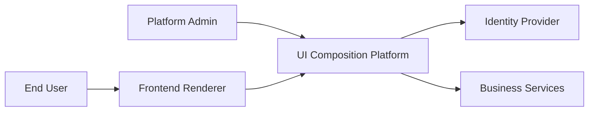
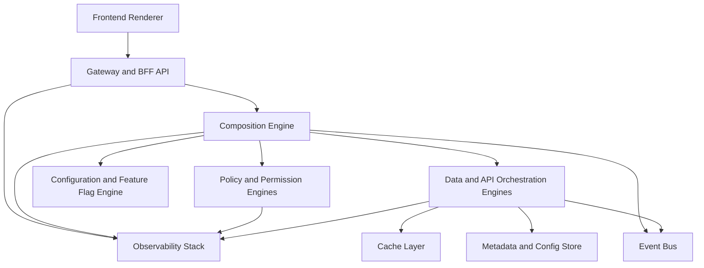
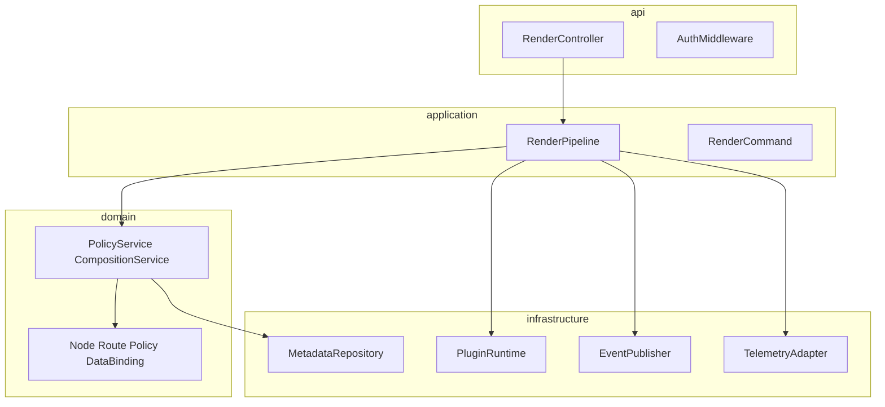

# C4 Diagrams

## Purpose
Provide aligned C4 views for context, containers, components, and code-level structure.

## Level 1: System Context

## Level 2: Container Diagram

## Level 3: Component Diagram (Backend)

```mermaid
flowchart LR
  Req[Request Handler] --> Auth[Auth Adapter]
  Auth --> RC[RenderContext Builder]
  RC --> Route[Route Resolver]
  Route --> Tree[Component Tree Resolver]
  Tree --> PE[Policy Evaluator]
  PE --> CE[Config Resolver]
  CE --> DE[Data Resolver]
  DE --> PX[Plugin Executor]
  PX --> SZ[UI Serializer]
  SZ --> Resp[Response Writer]
```

## Level 4: Code Diagram (Illustrative Package View)

## Diagram Maintenance Rules
- Update diagrams when engine boundaries or stage ordering changes.
- Include version/date metadata in pull requests touching architecture.
- Keep names consistent with ADR and domain model documents.
